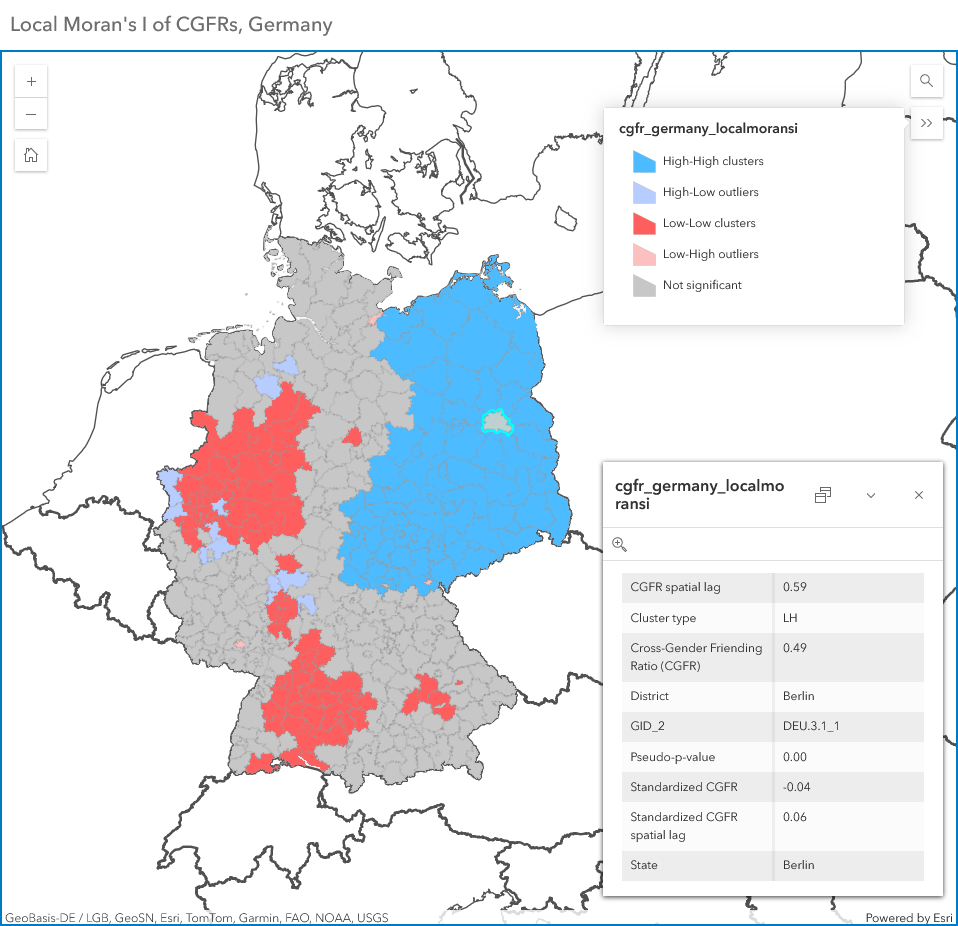

# Spatial Autocorrelation of Cross-Gender Friending Ratios using Moran's I
In this project, I designed a Python-based processing script that calculates global and local spatial autocorrelation of [cross-gender friending ratios (CGFRs)](https://drew-johnston.com/files/cross_gender_ties/Cross-Gender_Social_Ties_Around_the_World.pdf) using the [Moran's I](https://en.wikipedia.org/wiki/Moran%27s_I) statistic. Moran's I identifies spatial clustering in datasets, specifically areas with statistically significantly values that are abnormally above or below the mean. CGFRs are a dataset representing how people form equal (or unequal) shares of their ties with those of the opposite gender, as observed through their Facebook friend lists.

This script takes a dataset of CGFRs and matches them to a corresponding administrative boundary dataset obtained from the Database of Global Administrative Areas. It performs both global and local Moran's I analysis on the combined features by computing standardized CGFRs, corresponding spatial lag, and finally Moran's I and local Moran's I. Below is an [ArcGIS Online map](https://www.arcgis.com/apps/instant/basic/index.html?appid=11f65800681141d692334e16a102853c) of those results, which displays spatial clustering of CGFRs across districts in Germany (second-level administrative divisions). The code is derived from the textbook [Geographic Data Science with Python](https://geographicdata.science/book/intro.html). Access the code [here](crossgenderties_moransi.ipynb)!

## Skills
Geospatial Data Analysis, Web Mapping

## Tools
ArcGIS Online, ArcGIS Instant Apps, Python, Pandas, GeoPandas, PySAL

## Datasets
* [Cross-Gender Friending Ratios, Bailey et al. (2025)](https://data.humdata.org/dataset/cross-gender-ties)
* [Germany districts, Database of Global Administrative Areas (2022)](https://gadm.org/data.html)

# Map
You can access the map online at [this link](https://www.arcgis.com/apps/instant/basic/index.html?appid=11f65800681141d692334e16a102853c).

